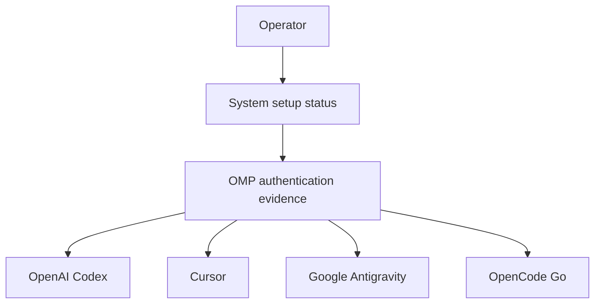

# OMP Authentication Graph

## Summary

Expose OMP's configured authentication for OpenAI Codex, Cursor, Google Antigravity, and OpenCode Go as advisory evidence in the machine setup graph. The graph will report local credential availability without reading secret values or contacting providers.

---

## Problem Frame

OMP can use several provider identities, but the current setup report only names OMP as a Cognee consumer. When a model is unavailable, an operator must inspect OMP's private state manually to determine whether the relevant credential is absent, disabled, or present. That makes routine setup verification incomplete and turns a local configuration question into ad-hoc investigation.

---

## Actors

- A1. Operator: reviews machine setup status and restores provider access when it is missing or disabled.
- A2. OMP runtime: owns the local credential state used to access model providers.
- A3. Model providers: Codex, Cursor, Google Antigravity, and OpenCode Go authentication targets.

---

## Key Flows

- F1. Advisory authentication review
  - **Trigger:** The operator runs system setup status.
  - **Actors:** A1, A2, A3.
  - **Steps:** The status report reads OMP's local credential metadata; it renders a separate result for each provider; the operator can see which credentials need attention without revealing credential contents.
  - **Outcome:** Enabled local credentials are visible as ready; unavailable, disabled, or unevaluable credentials are visible without blocking unrelated setup.
  - **Covered by:** R1, R2, R3, R4, R5

---

## Requirements

**Provider coverage**
- R1. The setup graph reports distinct OMP authentication evidence for OpenAI Codex, Cursor, Google Antigravity, and OpenCode Go.
- R2. Each provider is represented as an OMP-to-provider relationship so the graph explains what the credential enables.

**Evidence and privacy**
- R3. Status verifies only locally stored credential availability and enabled state; it makes no provider network request and does not refresh tokens.
- R4. Status never renders credential values, tokens, API keys, or account identities.
- R5. A missing or disabled credential is reported as action-needed; unreadable or incompatible OMP credential state is reported as unevaluable rather than misreported as logged out.

**Advisory behavior**
- R6. All OMP authentication results are advisory: they remain visible in normal status output but do not make unrelated machine setup incomplete.

---

## Acceptance Examples

- AE1. **Covers R1, R3, R4.** Given enabled local Codex, Cursor, Google Antigravity, and OpenCode Go credentials, when the operator runs setup status, the report shows four ready OMP authentication results and no secret or identity data.
- AE2. **Covers R5, R6.** Given a missing Cursor credential, when the operator runs normal setup status, Cursor is shown as action-needed while the command remains non-blocking for this advisory result.
- AE3. **Covers R5.** Given OMP credential metadata cannot be read, when the operator runs setup status, the report makes the failed evaluation visible and does not claim that all provider credentials are absent.

---

## Success Criteria

- An operator can identify the OMP provider authentication requiring attention from one setup report, without manual database inspection.
- No credential material or account identity is exposed in terminal output, the generated manifest, or declarative configuration.
- A missing optional provider credential does not block unrelated setup work.

---

## Scope Boundaries

- Live provider model requests, token-refresh checks, and quota validation are excluded.
- Standalone `agy` OAuth state is excluded unless it is verified to be the same credential state as OMP's Google Antigravity provider.
- This work does not add, remove, rotate, or repair OMP credentials.

---

## Key Decisions

- Local presence over live access: avoids provider latency, rate limits, token refresh, and paid/quota-bearing requests in the normal setup report.
- Advisory status over required status: providers remain visible while OMP's optional or exploratory access does not block the rest of the machine.
- Provider-level results: identifies the affected access path without treating OMP as one opaque all-or-nothing login.

---

## Dependencies / Assumptions

- OMP continues to retain non-secret credential metadata that distinguishes provider, credential kind, and enabled state.
- The setup graph can read only that metadata without loading credential payloads.
- OMP's Google Antigravity record is the intended Antigravity credential; standalone `agy` state remains independently owned unless verified otherwise.

---

## Outstanding Questions

### Deferred to Planning

- [R5][Technical] Determine the durable compatibility boundary for OMP credential metadata and the exact behavior when OMP changes it.
- [R2][Needs research] Verify whether standalone `agy` shares state with OMP's Google Antigravity credential before extending coverage to it.
