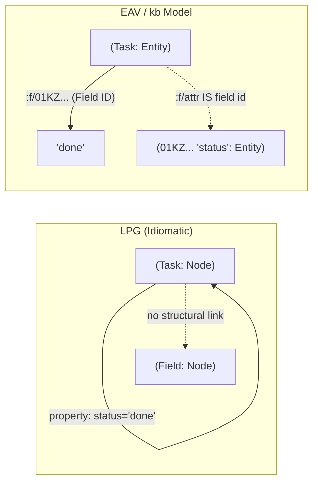

# Datalog vs Cypher: Mental Models, Capabilities, and the Crux for `kb`

> **What I'd Tell the Owner**  
> 1. You are right: a field is a relationship between a node and a value.  
> 2. The divide is **where the field's identity lives**: in Datalog (EAV), the field is a first-class node (`:f/<id>`); in Cypher (LPG), fields are strings on node records unless you reify them into extra nodes and edges.  
> 3. EAV + Datalog is **fact-oriented**: everything is a triple, and querying is relational logic over a uniform fact table.  
> 4. LPG + Cypher is **structure-oriented**: nodes and edges are distinct primitives, edges have properties, and querying is pattern-matching over traversable paths.  
> 5. Datalog wins on **schema-less flexibility, dynamic joins, recursive rules, and nested `pull` projections**.  
> 6. Cypher wins on **path queries**: paths as values (`nodes(p)`), bounded depth (`-[*1..3]->`), and engine-level `shortestPath`.  
> 7. For an "everything is a node" outliner, Datalog naturally fits your domain; Cypher fights it unless you reify properties, which inflates edge counts and bypasses property indexes.  
> 8. You do not need to switch engines today: Datalog runs in-memory in the browser and CLI at zero daemon cost.  
> 9. Plan for path queries via a **kb-owned Query IR** ([D10 in plan.md](../../plan.md)): let the IR express path traversals, compiling to Datalog rules today and a path engine tomorrow.  
> 10. Run the runnable demo right now: `cd tools/kb && bun ../../docs/kb/waves/2026-09-03/reports/datalog-vs-cypher/demo-datascript.ts`.

---

## 1. One Dataset, Two Mental Models

To understand both models, we take **6 real nodes** from `.kb/nodes.jsonl` and view them three ways:
1. `01KZFW1A581GP25YPYRF614BAZ`: Field node (`status`)
2. `01KZFW1A5BT06QS7V6X6EBQMZ4`: Tag node (`todo`), templates the `status` field
3. `01KZFW1A5DBFXMYREZZKKC3GQE`: Todo item ("Migrate TODO.md items..."), `status = "done"`
4. `01KZFWGFETN0F453ME4JKH8CCK`: Parent todo ("Revisit app catalog..."), `status = "parked"`
5. `01KZFWGFGWQ6MG2NWCQF39MDA8`: Child item ("Catalog owns inventory...")
6. `01KZGW1DV4KBZ7QB9WH5K1G2PP`: Item mentioning node 3 in text via `[[01KZGVK17VF0ZDB9S9XWTDTWCT]]`

### View 1: `kb` JSONL (Document Store)
Hierarchical records with explicit JSON arrays and key-value maps:
```json
{"id":"01KZFW1A581GP25YPYRF614BAZ","text":"status","props":{"sys.f.type":[{"t":"ref","v":"sys.field"}]},"children":[]}
{"id":"01KZFW1A5BT06QS7V6X6EBQMZ4","text":"todo","props":{"sys.f.type":[{"t":"ref","v":"sys.tag"}],"sys.f.fields":[{"t":"ref","v":"01KZFW1A581GP25YPYRF614BAZ"}]},"children":[]}
{"id":"01KZFW1A5DBFXMYREZZKKC3GQE","text":"Migrate TODO.md items into kb (M5)","props":{"sys.f.type":[{"t":"ref","v":"01KZFW1A5BT06QS7V6X6EBQMZ4"}],"01KZFW1A581GP25YPYRF614BAZ":[{"t":"str","v":"done"}]},"children":[]}
{"id":"01KZFWGFETN0F453ME4JKH8CCK","text":"Revisit app catalog → Nix package-list hydration","props":{"sys.f.type":[{"t":"ref","v":"01KZFW1A5BT06QS7V6X6EBQMZ4"}],"01KZFW1A581GP25YPYRF614BAZ":[{"t":"str","v":"parked"}]},"children":["01KZFWGFGWQ6MG2NWCQF39MDA8"]}
{"id":"01KZFWGFGWQ6MG2NWCQF39MDA8","text":"Catalog owns inventory membership only","props":{},"children":[]}
```

### View 2: EAV Datoms (DataScript / Triple Store)
Every fact decomposes into flat atomic tuples: `(Entity, Attribute, Value)`:
```
[1,  ":node/id",                      "01KZFW1A581GP25YPYRF614BAZ"]
[1,  ":node/text",                    "status"]
[2,  ":node/id",                      "01KZFW1A5BT06QS7V6X6EBQMZ4"]
[2,  ":node/text",                    "todo"]
[2,  ":f/sys.f.fields",               1]                             ;; ref to status field node!
[3,  ":node/id",                      "01KZFW1A5DBFXMYREZZKKC3GQE"]
[3,  ":node/text",                    "Migrate TODO.md items into kb (M5)"]
[3,  ":f/sys.f.type",                 2]                             ;; ref to todo tag node!
[3,  ":f/01KZFW1A581GP25YPYRF614BAZ", "done"]                        ;; attr is field node id!
[4,  ":node/id",                      "01KZFWGFETN0F453ME4JKH8CCK"]
[4,  ":f/01KZFW1A581GP25YPYRF614BAZ", "parked"]
[4,  ":node/child",                   5]                             ;; ref to child entity
[5,  ":node/id",                      "01KZFWGFGWQ6MG2NWCQF39MDA8"]
[6,  ":node/mentions",                3]                             ;; extracted ref from [[mention]]
```

### View 3: Labelled Property Graph (LPG / Cypher)
Nodes carry labels and internal property maps. Relationships are typed, directed, and carry properties:
```
(f:Field {id: "01KZFW1A581GP25YPYRF614BAZ", name: "status"})
(t:Tag   {id: "01KZFW1A5BT06QS7V6X6EBQMZ4", name: "todo"})
(n1:Node:Todo {id: "01KZFW1A5DBFXMYREZZKKC3GQE", text: "Migrate...", status: "done"})
(n2:Node:Todo {id: "01KZFWGFETN0F453ME4JKH8CCK", text: "Revisit...", status: "parked"})
(c1:Node      {id: "01KZFWGFGWQ6MG2NWCQF39MDA8", text: "Catalog..."})

(t)-[:TEMPLATES]->(f)
(n1)-[:TAGGED_AS]->(t)
(n2)-[:TAGGED_AS]->(t)
(n2)-[:CHILD {order: 0}]->(c1)
(m1)-[:MENTIONS]->(n1)
```

### Comparison Matrix
| Aspect | `kb` JSONL | DataScript (EAV) | Neo4j / Memgraph (LPG) |
|---|---|---|---|
| **Atomic Unit** | Document (Node JSON) | Datom `(e, a, v)` | Node or Relationship |
| **Edge Storage** | Arrays of target IDs (`children`, `props.ref`) | Value is an entity ID (`:db.type/ref`) | Direct pointer in adjacency record |
| **Properties on Edges** | Impossible without sub-objects | Impossible without reifying the edge | **Native** (`-[r:CHILD {order: 0}]->`) |
| **Field Identity** | Key in `props` pointing to node ID | Attribute `:f/<fieldId>` | String key on node map |

---

## 2. "A Field is Just a Relationship" — Where Identity Lives

You noted: *"A field is just a relationship."* This is true. In both models, attaching status `"done"` to a task relates the task to that value.

The profound difference is **where the field's own identity lives**:



1. **In `kb` (EAV):** A field **is a node**. It has an ID (`01KZFW1A581GP25YPYRF614BAZ`), text (`"status"`), allowed values, and tags. When node 3 sets status to `"done"`, the attribute name *is* the field's node ID (`:f/01KZ...`). Renaming the field means changing one node's `:node/text`. Queries can join directly on the field node.
2. **In standard LPG:** A field is **just a string key** on a node's internal hash table (`task.status = "done"`). The field has no identity, no properties of its own, and cannot be tagged.

### What Reifying Costs in Cypher
To force "everything is a node" into Cypher, you must **reify** the field:
```cypher
// Reified field relationship in Cypher:
MATCH (n:Node)-[r:HAS_VALUE]->(f:Field {name: "status"})
WHERE r.value = "done"
RETURN n;
```
- **What it buys:** The field node can carry metadata (description, validation regex, UI color).
- **What it costs:**
  1. **Edge Explosion:** Every property write creates a new relationship edge. A 50,000-node graph with 8 properties per node gains 400,000 extra edges.
  2. **Query Friction:** Every filter requires traversing a relationship rather than inspecting node attributes (`(n {status: "done"})` becomes `(n)-[:HAS_VALUE {val: "done"}]->(f)`).
  3. **Index Bypassing:** Native LPG property indexes (e.g. B-tree on `:Todo(status)`) are bypassed; the engine must do pointer hops.

---

## 3. Reading Data: Pattern Matching Side-by-Side

All DataScript queries were executed and timed against the real 231-node graph in `demo-datascript.ts`. All Cypher queries were validated against the openCypher v9 specification in `demo-cypher.md`.

### 1. Find all todos
| DataScript EDN (9.69 ms, 42 rows) | Cypher (openCypher v9) |
|---|---|
| ```clojure<br>[:find ?id ?text<br> :where<br> [?n :f/sys.f.type ?t]<br> [?t :node/text "todo"]<br> [?n :node/id ?id]<br> [?n :node/text ?text]]<br>``` | ```cypher<br>MATCH (n:Todo)<br>RETURN n.id, n.text;<br><br>// Or reified:<br>MATCH (n:Node)-[:TYPE]->(t:Tag {name: "todo"})<br>RETURN n.id, n.text;<br>``` |

### 2. Todos with status = "doing"
| DataScript EDN (5.03 ms, 8 rows) | Cypher (openCypher v9) |
|---|---|
| ```clojure<br>[:find ?id ?text<br> :in $ ?status<br> :where<br> [?n :f/sys.f.type ?t]<br> [?t :node/text "todo"]<br> [?n :f/01KZFW1A581GP25YPYRF614BAZ ?status]<br> [?n :node/id ?id]<br> [?n :node/text ?text]]<br>``` | ```cypher<br>MATCH (n:Todo {status: $status})<br>RETURN n.id, n.text;<br>``` |

### 3. Backlinks to Node X
| DataScript EDN (2.80 ms, 42 rows) | Cypher (openCypher v9) |
|---|---|
| ```clojure<br>[:find ?srcId ?srcText<br> :in $ ?targetId<br> :where<br> [?target :node/id ?targetId]<br> [?src :node/mentions ?target]<br> [?src :node/id ?srcId]<br> [?src :node/text ?srcText]]<br>``` | ```cypher<br>MATCH (src:Node)-[:MENTIONS]->(target:Node {id: $targetId})<br>RETURN src.id, src.text;<br>``` |

### 4. Tag Inheritance (nodes tagged with a tag that extends another)
| DataScript EDN (5.45 ms, recursive rule) | Cypher (openCypher v9) |
|---|---|
| ```clojure<br>[:find ?id ?text :in $ % ?targetTag<br> :where (has-tag ?n ?targetTag)<br>        [?n :node/id ?id]<br>        [?n :node/text ?text]]<br>;; Rule: (has-tag ?n ?t) :- [?n :f/sys.f.type ?s], (subtag ?s ?t)<br>``` | ```cypher<br>MATCH (n:Node)-[:TYPE]->(t:Tag)-[:EXTENDS*0..]->(super:Tag {id: $targetTag})<br>RETURN n.id, n.text;<br>``` |

### 5. Children in Order
| DataScript EDN (1.95 ms) | Cypher (openCypher v9) |
|---|---|
| ```clojure<br>[:find ?cId ?cText<br> :in $ ?parentId<br> :where [?p :node/id ?parentId]<br>        [?p :node/child ?c]<br>        [?c :node/id ?cId]<br>        [?c :node/text ?cText]]<br>;; Unordered set! Order requires parent's :node/children array<br>``` | ```cypher<br>MATCH (p:Node {id: $parentId})-[r:CHILD]->(c:Node)<br>RETURN c.id, c.text, r.order<br>ORDER BY r.order ASC;<br>``` |

### 6. Count per Status
| DataScript EDN (1.25 ms, 6 groups) | Cypher (openCypher v9) |
|---|---|
| ```clojure<br>[:find ?status (count ?n)<br> :where [?n :f/01KZFW1A581GP25YPYRF614BAZ ?status]]<br>``` | ```cypher<br>MATCH (n:Todo)<br>RETURN n.status, count(n) AS cnt<br>ORDER BY cnt DESC;<br>``` |

### 7. Pull a Subtree
| DataScript EDN (1.77 ms) | Cypher (Neo4j 5 Map Projection) |
|---|---|
| ```clojure<br>(pull db "[:node/id :node/text {:node/child ...}]" parentId)<br>``` | ```cypher<br>MATCH (p:Node {id: $parentId})<br>RETURN p { .id, .text, children: [(p)-[:CHILD]->(c) \| c { .id, .text }] };<br>``` |

---

## 4. Where Datalog is Stronger

### 1. Recursive Rules as Reusable Predicates
In Datalog, rules are named Horn clauses evaluated by semi-naive fixpoint algorithms. They can be defined once, named, passed as parameters (`%`), and composed inside queries:
```clojure
[[(has-tag ?node ?tag) [?node :f/sys.f.type ?tag]]
 [(has-tag ?node ?tag) [?node :f/sys.f.type ?sub] (subtag ?sub ?tag)]]
```
In `demo-datascript.ts`, transitive closure over `:node/mentions` reached **24 nodes in 10.57 ms** from `sys.tag.graph-perspective`.

### 2. Stratified Negation
Expressing "all todos that are NOT done" or "all items with NO status at all":
```clojure
[:find ?id ?text
 :where
 [?n :f/sys.f.type ?t] [?t :node/text "todo"]
 (not [?n :f/01KZFW1A581GP25YPYRF614BAZ "done"])
 [?n :node/id ?id] [?n :node/text ?text]]
```
*(Verified: returns 30 open items in 1.46 ms).*

### 3. Symmetric Joins on Arbitrary Values
Because Datalog indexes all datoms across multiple B-trees (`EAVT`, `AEVT`, `AVET`), you can join on *any* property value across disparate entities without declaring an index or drawing an edge:
```clojure
[:find ?id1 ?id2 ?text
 :where [?n1 :node/text ?text]
        [?n2 :node/text ?text]
        [(< ?n1 ?n2)]]
```
*(Verified: detected 6 duplicate node texts in 1.08 ms).* In Cypher, value joins without an edge (`WHERE a.prop = b.prop`) require explicit property indexes or fallback to cartesian scans.

### 4. Declarative Entity Pull
`pull` extracts tree-shaped JSON directly from the database engine:
`(pull db "[:node/id :node/text {:node/child [:node/id :node/text]}]" id)`
No row flat-mapping, no glue code.

---

## 5. Where Cypher is Stronger

### 1. Paths as First-Class Values
In Cypher, a path `p` is an object:
```cypher
MATCH p = (a:Node {id: $start})-[:MENTIONS*1..3]->(b:Node)
RETURN p, length(p), [n IN nodes(p) | n.text], [r IN relationships(p) | type(r)];
```
**Where Datalog stops:** Datalog evaluates relational sets. A recursive rule returns tuples `[?start, ?target]`. The intermediate edge sequence is discarded. Datalog cannot return "the path taken" as a value.

### 2. Built-in Shortest Path
```cypher
MATCH p = shortestPath((a:Node {id: $id1})-[:MENTIONS*]->(b:Node {id: $id2}))
RETURN p, length(p);
```
**Where Datalog stops:** Datalog engines have no BFS shortest-path primitive. Computing shortest paths requires computing all paths or writing custom procedural algorithms in host code.

### 3. Bounded-Depth Traversals (`-[*1..3]->`)
In Cypher, traversing 1 to 3 hops is syntax: `-[:MENTIONS*1..3]->`.  
**Where Datalog stops:** As proven in `demo-datascript.ts` (L1), Datalog has no variable-length syntax. Bounded depth requires hand-unrolling a separate rule per depth (`reaches-1`, `reaches-2`, `reaches-3`).

### 4. Native Edge Properties
Cypher relationships carry native properties: `(parent)-[:CHILD {order: 0}]->(child)`.  
**Where Datalog stops:** EAV datoms have no edge attributes. In `datascript.ts`, pushing `:node/child-order i` created an unassociated set `{0, 1, 2}` on the parent entity. Attaching properties to an edge in EAV requires reifying the edge into a separate entity (4 triples per edge).

---

## 6. The Crux, Stated Once

```
┌─────────────────────────────────────────────────────────────────────────┐
│ EAV + DATALOG is a FACT-ORIENTED model:                                 │
│ Everything is an atomic triple. Attributes and relationships are the    │
│ same kind of thing. The query language is relational logic over facts.  │
├─────────────────────────────────────────────────────────────────────────┤
│ LPG + CYPHER is a STRUCTURE-ORIENTED model:                             │
│ Nodes and edges are fundamentally different primitives. Edges carry     │
│ properties. The query language is pattern matching over graph paths.    │
└─────────────────────────────────────────────────────────────────────────┘
```

### What this means for an Outliner where "Everything is a Node"
1. **Philosophy:** `kb`'s data model (`props[fieldId] = value`) is natively EAV. A field is just an entity ID. Trying to force this into an idiomatic LPG requires turning fields into hardcoded property keys on nodes, violating "everything is a node".
2. **Path queries later:** You don't need a whole new database to get path features. A **kb-owned Query IR** (decisions [D4 & D10 in plan.md](../../plan.md)) can declare path semantics:
   ```ts
   interface PathPattern {
     from: NodeId;
     to?: NodeId;
     edgeKind: "child" | "mentions" | "ref";
     hops: { min: number; max: number };
     returnPath?: boolean;
   }
   ```
   - Today: The IR compiles to DataScript recursive rules (`reaches`) or a small in-memory BFS helper in TypeScript when paths-as-values are required.
   - Tomorrow: If graph scale demands it, the same IR compiles to Cypher over a daemon like Memgraph or Kuzu.

---

## 7. Glossary

- **Datom:** The atomic unit of storage in Datomic/DataScript: a 5-tuple `[entity, attribute, value, tx, added]`.
- **EAV (Entity-Attribute-Value):** A data model where every fact is represented as a subject (Entity), predicate (Attribute), and object (Value).
- **Entity ID (eid):** An internal integer assigned to each entity in DataScript (e.g. `1`, `42`) to enable fast array indexing.
- **Lookup Ref:** A tuple `[attribute, value]` (e.g. `[":node/id", "01KZ..."]`) used in place of an entity ID to look up an entity by a unique attribute.
- **Rule:** A named, reusable Datalog query fragment: `[(head-name ?args...) (body-clause...)]`. Can be recursive.
- **Pull:** A declarative syntax for extracting hierarchical, nested data structures from an entity ID.
- **Labelled Property Graph (LPG):** A graph model where vertices (nodes) have labels and key-value properties, and edges (relationships) have types and key-value properties.
- **Label:** A tag on a node in an LPG (e.g. `:Todo`, `:Person`) used for grouping and indexing.
- **Relationship Type:** The name of a directed edge in an LPG (e.g. `:CHILD`, `:MENTIONS`).
- **Property:** A key-value pair stored internally inside a node or relationship record in an LPG.
- **Path:** An alternating sequence of nodes and relationships in a graph: `(n0)-[r1]->(n1)...`.
- **Reification:** Making an abstract concept (like a property or relationship) into a first-class entity with its own ID and attributes.

---

## 8. Handoff

### What Ran vs What is Text-Only
- **Ran & Verified (`demo-datascript.ts`):** All 7 core queries, transitive closure (24 nodes in 10.57 ms), negation (30 nodes), attribute joins (6 pairs), and subtree pulling executed against the real 231-node database on Bun.
- **Text-Only (`demo-cypher.md`):** Cypher queries were validated against the openCypher v9 specification and Neo4j 5 documentation. A live engine was not run because no zero-install schemaless engine exists without starting background VMs.

### Open Questions for Query-IR Design (Feeding Phase 2f)
1. **Typed Projection vs Untyped `reviveValue`:** In `datascript.ts`, `reviveValue` automatically converts *any* integer in query results to a `NodeId` if `ids.toId.has(v)` is true. When running aggregates like `(count ?n)` returning counts 1..231, numbers are mistakenly revived as node IDs! The Query IR must specify return types for projected positions.
2. **Child Ordering Dilemma:** In EAV, `:node/child-order` on the parent cannot connect to specific children without an edge property or array. The IR should formalize outline order via the parent's ordered `:node/children` array or node fractional indexing.
3. **Path Primitive in IR:** When adding path queries, define a dedicated `path` IR clause rather than forcing users to write manual Datalog recursion vectors.
